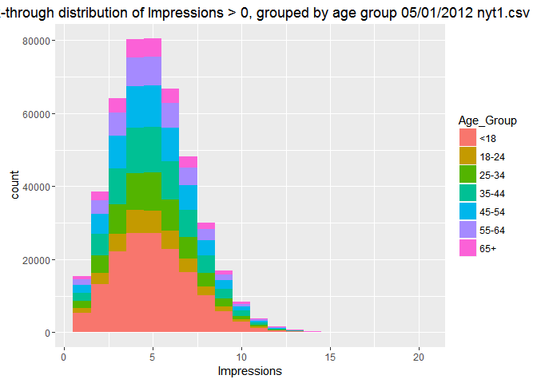
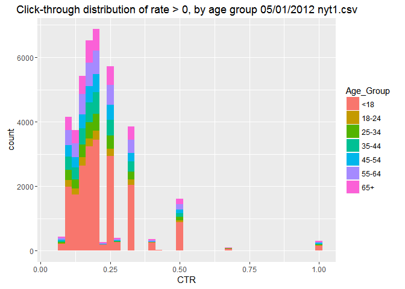

#  Click Stream 
Salomon Gilles  
July 10, 2016  


## Summary:

This exercise demonstrates using the ggplot package for enhancing visualization using R Markdown. There is a total of 31 dataset files. Download is done dynamically into memory during run to ensure no interaction with users local storage.A for loop is used to process all files. To loop through each file, thanks to the name manner of the files, we use the current subscript to build the file name which is appended to the url for download : "http://stat.columbia.edu/~rachel/datasets. We then download the file, apply the processing, mainly adding an age group field to the data set, computing the clicks and ggplotting. First, for click impressions and the second time, for click rates. 

Because of the long processing time it may take given the huge number and size of file, I added a break to control what is processed. The default is to run the entire loop. This will take quite some time. If you just wish to process the first dataset only, prepend a # to the break statement.

The final output is a html document.


```r
# include ggplot2 library
library(ggplot2) # used for visualizations

# build portions of url so you append file number from 1 to 31 in the loop
partialurl <- "http://stat.columbia.edu/~rachel/datasets/nyt"
fileprefix <- ".csv"

for (index in 1:31)
{
  ##build complete url
  fileUrl <- paste0(partialurl, index, fileprefix)
  # download file specified at url fileurl
  nytdata <- read.csv(url(fileUrl))
  # display some data from the top of file
  head(nytdata)

  ## create a new variable named Age_Group, 
  # that groups users into age categories “<18”, “18-24”, “25-34”, “35-44”, “45-54”, “55-64”, and “65+”
  nytdata$Age_Group <- cut(nytdata$Age, c(-Inf, 18, 24, 34, 44, 54, 64, Inf))
  # Name the levels of 'Age_Group' for readability
  levels(nytdata$Age_Group) <- c("<18", "18-24", "25-34", "35-44", "45-54", "55-64", "65+")
  
  ## create subset of > 0 impressions
  d1 <- subset(nytdata, Impressions>0)
  # Add a column to d1 called CTR containing the click-through-rate
  d1$CTR <- d1$Clicks/d1$Impressions
  
  ## do head of d1 dataset
  head(d1)
  
  ## using ggPlot2, plot the distribution of Impressions>0, grouped by Age_Group
  mytitle <- paste0("Click-through distribution of Impressions > 0, grouped by age group 05/01/2012 ", "nyt", index, ".csv")
  ggvalue01 <- ggplot(subset(d1, Impressions>0), aes(x=Impressions, fill=Age_Group)) + labs(title=mytitle) + geom_histogram(binwidth=1)
  print(ggvalue01)
  
  ## Plot the distribution of CTR>0, grouped by Age_Group
  mytitle <- paste0("Click-through distribution of rate > 0, by age group 05/01/2012 ", "nyt", index, ".csv")
  ggvalue02 <- ggplot(subset(d1, CTR>0), aes(x=CTR, fill=Age_Group)) + labs(title=mytitle) + geom_histogram(binwidth=.025)
  print(ggvalue02)
  ## return resource to system
  nytdata <- NULL
  d1 <- NULL
  # Note : to run all files, uncomment the following break statement by prepending a # to the break statement.
  break;
}
```

<!-- --><!-- -->

